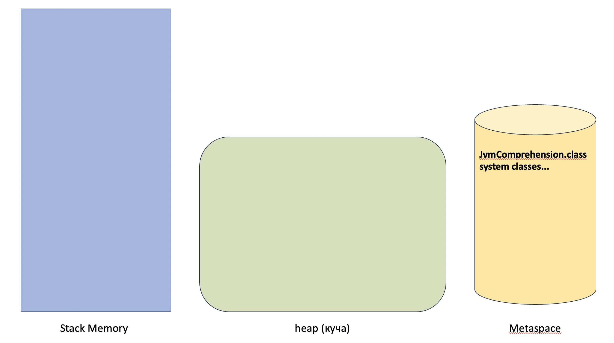

# **Задание № 1**

1. происходит подгрузка класса JvmComprehension и системных классов с помощью ClassLoader'ов в Metaspace. JvmComprehension загружается Application ClassLoader, а системыные классы из JDK Bootstrap ClassLoader.

2. При выполнении медота main() cоздается фрейм main() в Stack Memory

3. Выделяется память в Stack Memory во фрейме main() для примитивной переменной int i и присваивается значение 1

4. Создается экземпляр класса Object в heap (куче) и ссылка "o" на данный экземплар класса сохраняется в Stack Memory во фрейме main()

5. Создается экземпляр класса обертки Integer в heap (куче) и ссылка "ii" на данный экземпляр класса сохраняется в Stack Memory во фрейме main()

6. Вызывается метод printAll() и создается новый фрейм в Stack Memory. В данном стеке создаются новые ссылки на экземплары классов Object и Integer (которые ведут на уже созданные экземпляры классов в heap (куче)) и выделяется память для переменной int i, которой присваивается значение ранее созданной переменной i = 1

7. Создается экземпляр класса обертки Integer в heap (куче) и ссылка "uselessVar" на данный экземпляр класса сохраняется в Stack Memory во фрейме printAll() после чего сам кземпляр класса и ссылка на него могут быть удалены сборщиком мусора, так как более не используются в коде.

8. Вызывается метод System.out.println() и создается новый фрейм в Stack Memory. В данном стеке у экземпларов классов "o" и "ii"  вызывается метод toString (в отдельном фрейме), который веpнет экземпляры класса String (и по итогу выполнения фрейм будет закрыт). по итогу выполнения метода System.out.println() будут очищены созданные экземпляры класса String и закрыт фрейм System.out.println() и фрейм printAll()

9. Перед вызовом System.out.println("finished") может быть проведена очистка от экземпляров классов Integer, Object и ссылок на них "o" и "ii" и от примитивной переменной int i так как они более не используются. Вызывается метод System.out.println("finished") и создается новый фрейм в Stack Memory с экземпляром класса String  со значением "finished". по итогу выполнения метода все фреймы будут закрыты и программа завершена
